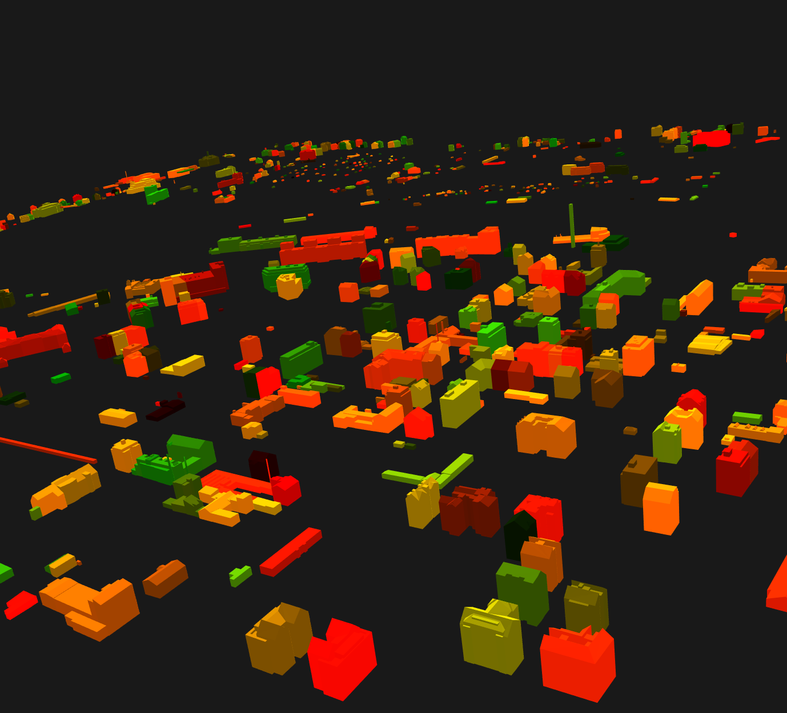
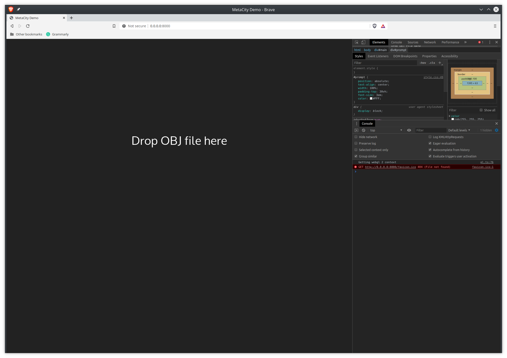
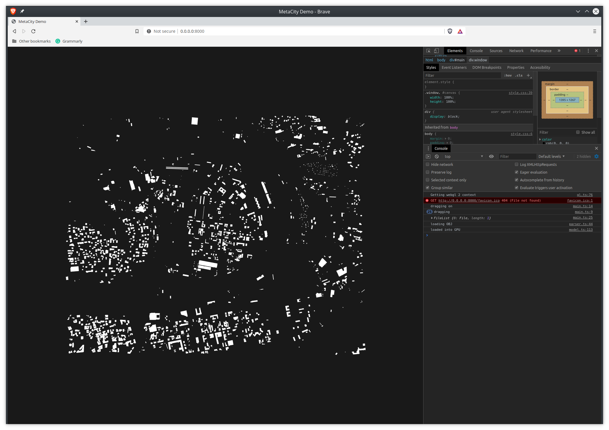
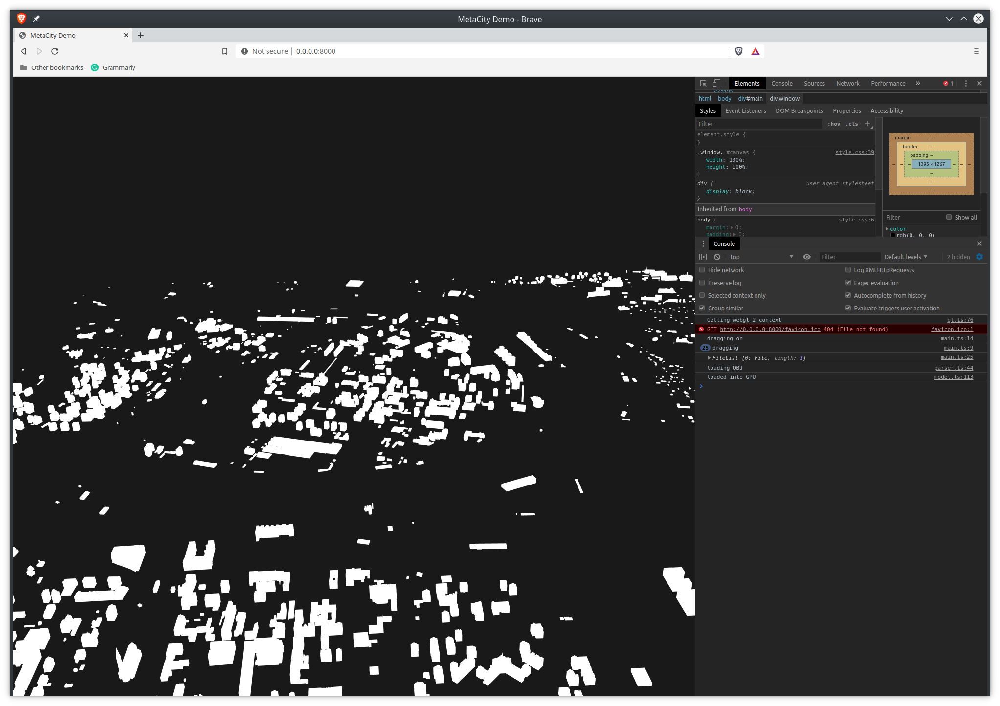

# MetaCity Demo

Consists of:
* Model Processing Pipeline
* Actual WebGL Demo

## Basic Model Processing Pipeline

Input files: `.gml` (and `.shp` for later)
1. Create CityJSON from CityGML using [citygml-tools](https://github.com/citygml4j/citygml-tools)
2. Create OBJ file from CityJSON using [cjio](https://github.com/cityjson/cjio)

The pipeline relies on the fact that the **exported OBJ uses CityJSON IDs as object names**

3. Optimize OBJ in order to allow for faster picking
4. Visualize using demo
5. Pick buildings and display information

## What works so far
All source can be found in [the demo folder](./demo), the project is written in TypeScript and compiled into a single `.js` file - see output [script.js](./demo/build/script.js).

### How to run
Run `make serve` or `python3 -m http.server` from the `demo` folder, pull up the address `0.0.0.0:8000` in your browser and drop in the `.obj` file. Demo OBJ file can be found in the demo folder. CityGML, CityJSON and other files are not backed on GitHub and are stored only locally. 

## TODOs
Checked marks done:

* [ ] create script which streamlines the pipeline
* [x] load OBJ into WebGL - (parse OBJ, load and compile shaders, write wrappers for the most common GL calls, lay down the basic structure of the project)
* [x] allow *smooth* rotation/zoom
* [x] process the OBJ in order to allow for picking (objects must not share vertices (via elements))
* [ ] **WORK IN PROGRESS** - allow for object picking - [source](http://learnwebgl.brown37.net/11_advanced_rendering/selecting_objects.html), [another source](https://webglfundamentals.org/webgl/lessons/webgl-picking.html)
* [ ] load CityJSON and pair the picked building with its metadata 
* [ ] add terain
* [ ] add street data (not present in CityJSON)
* [ ] would be nice to have custom exporter from CityGML or CityJson to obj so we don't rely on consistency of the exported IDs
* [ ] combine with simulated winds

## Existing Solutions and Sources
* https://github.com/cityjson/ninja
* https://github.com/cityjson/cityjson-vue-components
* https://www.cityjson.org/help/users/conversion/
* [A bit about CityGML](http://en.wiki.quality.sig3d.org/index.php/Modeling_Guide_for_3D_Objects_-_Part_1:_Basics_(Rules_for_Validating_GML_Geometries_in_CityGML))
* https://www.cityjson.org/citygml-compatibility/#citygml-features-not-supported